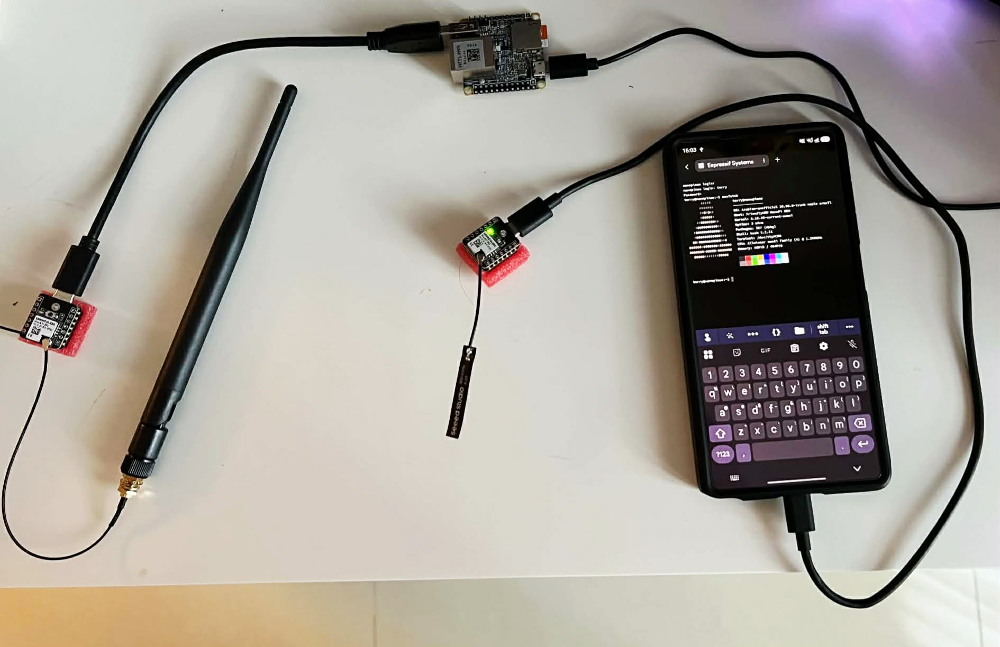
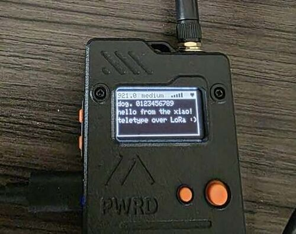
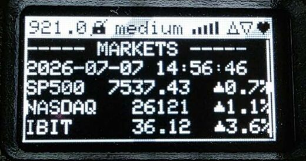
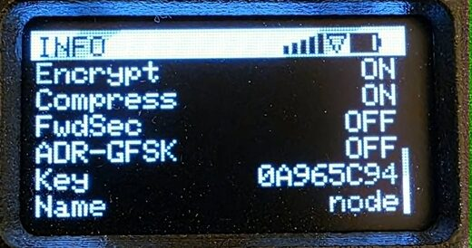
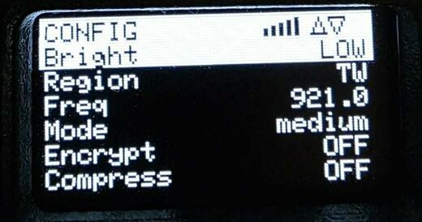
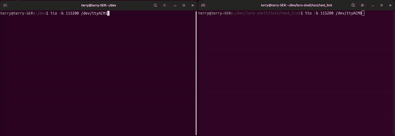
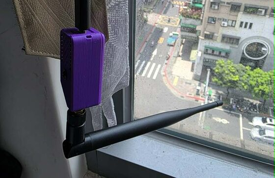
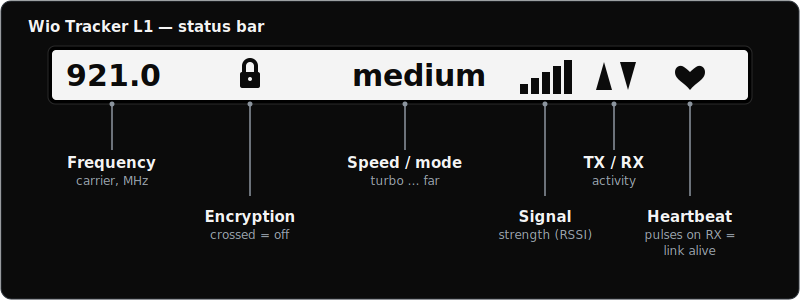

# LoRa Serial Link — a reliable point-to-point "wireless serial cable"

**Turn two LoRa boards into a wireless serial cable.** Plug a terminal or serial
device into either end; whatever you send comes out the other side, byte-exact,
kilometers away. It's a transparent serial port that happens to be a long-range
radio — **fully custom firmware with its own link layer and on-air protocol,
built from the ground up**: not Meshtastic, not LoRaWAN, with
[RadioLib](https://github.com/jgromes/RadioLib) the only radio dependency. It currently supports two boards: a headless **XIAO ESP32-S3** node
and a **Wio Tracker L1** that can show the stream on its OLED (see
[Supported boards](#supported-boards)).

> **Built with Claude (AI-assisted development)** — Claude Opus 4.8 for most of
> it. This wasn't one-shot "vibe coding" — the initial project came together
> over **~5 days** (through July 7, 2026), including the first Wio Tracker L1
> display-node work, across many iterations with a lot of direction:
> architecture, design decisions, coding standards, testing and diagnostic
> approaches, and the UI, closely guided at each step (the working rules are in
> [CLAUDE.md](./CLAUDE.md)). In practice it was roughly a **10× throughput
> gain** — work that would have taken 2–3 days took 2–3 hours. Truly remarkable
> what can be done. Is it 'perfection'? No — but the tradeoff, I believe, is
> worth it.

<table align="center">
<tr>
<td align="center" width="430"></td>
<td align="center" width="430"></td>
</tr>
<tr valign="top">
<td align="center" width="430"><b>XIAO ESP32-S3 node</b><br/><sub>The headless serial cable — here bridging a NanoPi's console to a phone logged in over the air.</sub></td>
<td align="center" width="430"><b>Wio Tracker L1 display node</b><br/><sub>Same firmware plus an OLED — it shows the received stream on its screen.</sub></td>
</tr>
</table>

<table align="center">
<tr>
<td align="center"></td>
<td align="center"></td>
<td align="center"></td>
</tr>
<tr><td colspan="3" align="center"><sub><i>The <a href="#supported-boards">L1</a>'s three screens — a live feed of received text, read-only diagnostics (incl. a key fingerprint you can match across units), and the on-device settings menu.</i></sub></td></tr>
</table>

<table align="center">
<tr><td align="center"></td></tr>
<tr><td align="center"><sub><i>A live session (sped up): configuring the radios and logging in over the LoRa link from an ordinary terminal.</i></sub></td></tr>
</table>

## Contents

- [Quick start: flash a release](#quick-start-flash-a-prebuilt-release)
- [What you get](#what-you-get) · [Supported boards](#supported-boards)
- [Background](#background) · [Docs index](#docs)
- [Build from source](#build-from-source) · [Architecture](#architecture-a-smart-radio-modem)
- [Login terminal](#use-it-as-a-login-terminal--no-custom-software) · [AT / config](#configure-over-at-commands)
- [Regulatory](#regulatory) · [Roadmap](#roadmap)

## Quick start: flash a prebuilt release

[](https://github.com/terry-lentz/lora-serial/releases/latest)

Don't want to build from source? Grab the latest release and flash both ends.
Every board runs the **same on-air protocol** and auto-elects its role at boot,
so **any pair works** — two XIAOs, two L1s, or one of each. The two boards are
**different chips** (ESP32-S3 vs nRF52840), though, so each takes its **own
image and flashing method** — there's nothing to auto-detect, just match the
file to the board:

| Step | What to do |
|---|---|
| **1 · Download** | From the **[latest release](https://github.com/terry-lentz/lora-serial/releases/latest)**, grab the image **named for your board's chip**: XIAO ESP32-S3 → **`lora-serial-<version>.xiao_esp32s3.firmware.bin`**; Wio Tracker L1 → **`lora-serial-<version>.wio_tracker_l1.uf2`**. |
| **2 · Flash — XIAO ESP32-S3** | Open the **[ESP web flasher](https://espressif.github.io/esptool-js/)**, connect the board, and flash the `.bin` at offset `0x0`. |
| **2 · Flash — Wio Tracker L1** | **Double-tap the RST button** — a `TRACKER L1` USB drive appears — then **copy the `.uf2`** onto it. No esptool, no toolchain. |
| **3 · Power on** | Power both ends. They auto-pair and encrypt, then run on the reliable **`medium`** mode at full power; open a serial terminal (or watch the L1's screen) and start sending. |

**Defaults, out of the box** — the pair **auto-pairs** (deriving a unique
per-pair key on first boot), is **encrypted by default**, and runs at a **fixed
`medium` mode and full TX power** — the reliable, no-surprises path. The two
adaptive features (**auto speed** / ADR and **auto power**) are **opt-in** and
still **experimental** — see the note below. You don't have to touch anything
unless you want to override a setting:

- **Encryption key** — already encrypted on a built-in key; run **`AT+TRAIN`**
  once on both ends for a unique per-pair key. See
  [SECURITY.md](./docs/SECURITY.md).
- **Speed** — ships on a fixed **`medium`** mode. Check it with **`AT+MODE?`**;
  switch with **`AT+MODE=<name>`** (then **`AT&W`** to persist). Pick a
  band-compliant mode for your region — see **Regulatory** below.
- **TX power** — full power by default; **`AT+PWR=<dBm>`** to set a fixed lower
  value.

> ⚠️ **Auto speed and auto power are experimental (off by default) — novel, and
> promising.** As far as we've found, no other open-source point-to-point LoRa
> link does these: LoRaWAN's ADR is network-server-driven for a star of nodes
> around a gateway, and Meshtastic/Reticulum set TX power by hand. Here they're
> **peer-coordinated on a symmetric two-node link** — adaptive data rate keyed
> off SNR *and* the live retransmit rate, plus a closed-loop peer-SNR power loop.
> Both pass the native sim and show real promise, but field testing surfaced
> cases they don't yet handle reliably (ADR can wedge in the slowest mode on a
> marginal link; auto-power can leave a just-switched mode below its demod
> floor), so they need more validation before we'd call them stable. Enable them
> to experiment — the fixed-mode default is what we trust for everyday use.
> Details in [CAPABILITIES_JOURNEY.md](./docs/CAPABILITIES_JOURNEY.md).

(The XIAO's `.firmware.bin` is the full image that boots a blank chip; the
release also ships an `.app.bin` for OTA — see the release notes.) **Prefer to
build from source?**
See **[Build from source](#build-from-source)** below.

## What you get

Not a toy demo — a full transparent serial transport with its own
Selective-Repeat link layer, a runtime-tunable radio, real authenticated
encryption, and on-device diagnostics:

- 🔌 **Plug-and-play transparent serial.** Each end is a plain USB serial port —
  bytes in one come out the other byte-exact, with no host software. Works with
  `tio`, PuTTY, `screen`, phone serial apps, or `agetty` for a login shell over
  LoRa (verified with PuTTY, Termius on Android/Linux; use PuTTY on Windows).
- 🆔 **Zero-effort setup.** Flash the *same* image to both boards and power on:
  they auto-elect roles + addresses from their chip MACs and proximity-pair once
  at low power on first boot — no numbering, no config, and encrypted immediately.
- ✅ **Reliable & byte-exact.** A custom Selective-Repeat ARQ link layer — SACK,
  a BDP-sized auto-sizing window, fragmentation, optional compression (`AT+COMP`)
  — verified byte-exact through 30% loss and multi-MB transfers, over a
  **formally model-checked** turn/recovery state machine
  ([DESIGN.md](./docs/DESIGN.md), [MODE_SWITCH_SPEC](./docs/MODE_SWITCH_SPEC.md)).
- 🔒 **Encrypted by default.** Ascon-128 AEAD (a NIST lightweight-crypto standard)
  with replay protection, on out of the box; **`AT+TRAIN`** derives a unique
  per-pair key over the air via X25519 (the secret never transmitted, kept in
  NVS), with optional forward secrecy ([SECURITY.md](./docs/SECURITY.md)).
- ⚡ **Speed vs. range on the fly.** Six modes from **turbo** (SF5) to **far**
  (SF12) plus an experimental **ludicrous** GFSK mode — `AT+MODE=<name>` retunes
  both ends live, no reflash; frequency, sync word, and TX power tune live too.
  Adaptive data rate (`AT+MODE=auto`) and auto-power are opt-in and experimental
  (see the note above).
- 🩺 **Diagnostics & self-healing.** Live link/session stats (`AT+LINK?`,
  `AT+SESSION?`), crash forensics with decodable core dumps (`AT+DIAG`, and
  `AT+CRASH` to exercise them), a built-in throughput tester, and watchdogs + an
  auto-recovery state machine. Host-side [`tools/`](./tools/README.md) drive it
  all.
- 🧩 **Cheap, generic hardware + a real test bench.** Runs on any LoRa radio
  [RadioLib](https://github.com/jgromes/RadioLib) supports. A native simulation
  (`pio test -e native`) models real hardware quirks — mode-deaf delivery,
  SNR-driven loss, backpressure, a radio going deaf — so changes are proven
  before they reach a board.

**Speeds at a glance** (measured, byte-exact, encrypted; compressed = best case
on text/logs, uncompressed = worst case on random binary):

| Mode | ≈ vintage link | Uncompressed | Compressed | Rough range\* |
|---|---|---|---|---|
| **ludicrous** (GFSK)‡ | ≈ ISDN | ~7.5 KB/s | **~12 KB/s** | very short |
| **turbo** | ≈ 56K–ISDN | ~4.0 KB/s | ~9.0 KB/s | ~0.5–1 km |
| **medium** (default) | ≈ 28.8K | ~1.0 KB/s | ~3.2 KB/s | ~2–4 km |
| **far** | sub-300-baud | ~0.014 KB/s | ~0.04 KB/s | ~10–15+ km |

\* Range is a line-of-sight estimate; see [docs/THROUGHPUT.md](./docs/THROUGHPUT.md)
for all six modes, both compression cases, and the measurement method.

‡ `ludicrous` is an **experimental, opt-in** GFSK mode for very short range — the
fastest mode, but no spreading gain. See the modes table below.

> **New to radio?** Start with **[docs/RADIO_BASICS.md](./docs/RADIO_BASICS.md)** — a
> plain-English primer (spreading factor, dBm, what LoRa actually is) built on a
> "talking across a field" analogy. No jargon, no math.

### Other radios (LoRa vs SiK vs HaLow)

This project uses **LoRa** for its decode-below-the-noise range at very low
power. If you need more raw speed, a different radio might fit better — a swap is
a **throughput/feature upgrade, not a reliability fix** (the flakiness in this
project's history was software, since fixed, not the radio). The short version:

| Radio | Modulation | Throughput | Range | Best for |
|---|---|---|---|---|
| **LoRa** (this project) | Chirp spread spectrum | ~1–12 KB/s | km-scale (up to ~10–15+ km) | Max range at min power; obstructed links; battery |
| **SiK / FSK** (RFD900x) | (G)FSK | ~2–250 kbps | few km (40+ km best-case) | Higher-rate P2P with a power budget; FHSS telemetry |
| **Wi-Fi HaLow** (802.11ah) | OFDM, sub-GHz | ~1–15 Mbps | ~1 km+ | Mbps sub-GHz at ~km, with an IP stack |

Full comparison — the trade-offs, licensing, honorable mentions (CC1200, BLE
Coded PHY), and the low-power future — is in
[docs/HW_ALTERNATIVES.md](./docs/HW_ALTERNATIVES.md).

## Supported boards

The link runs on **any LoRa radio [RadioLib](https://github.com/jgromes/RadioLib)
supports**. Two boards are first-class, built from the *same* `src/` firmware
behind a small platform layer (`src/platform/`), so both ends always speak an
identical protocol:

| Board | What it is | Where to buy (Seeed Studio) | Docs |
|---|---|---|---|
| **XIAO ESP32-S3 + Wio-SX1262** | The primary node (most of this README) — a headless USB serial port; flash `node_raw` to both ends. | [XIAO ESP32-S3](https://www.seeedstudio.com/XIAO-ESP32S3-p-5627.html) + Wio-SX1262 LoRa module | [Seeed kit wiki](https://wiki.seeedstudio.com/wio_sx1262_with_xiao_esp32s3_kit/) |
| **Seeed Wio Tracker L1**<br/>(nRF52840 + SX1262 + 1.3″ OLED) | A **receive-and-display node** — a serial port that also renders the stream on its screen, with an on-device menu; flash `wio_l1`. | [Wio Tracker L1](https://www.seeedstudio.com/Wio-Tracker-L1-p-6453.html) | [Seeed wiki](https://wiki.seeedstudio.com/wio_tracker_l1_node/) · [our port notes](./docs/WIO_TRACKER_L1.md) |

<table align="center">
<tr><td align="center"></td></tr>
<tr><td align="center"><sub><i>A XIAO node deployed in the wild — 3D-printed case and whip antenna, on a window in Taipei.</i></sub></td></tr>
</table>

### Wio Tracker L1 — the display node

The L1's OLED has three screens; the **user button** cycles between them and the
**trackball** navigates. A top status bar is on every screen:



Left to right: the carrier **frequency**, an **encryption** padlock (crossed out
when off), the **speed/mode**, a **signal** meter (the measured **SNR margin**
above the mode's demod floor — what actually predicts decode, not raw RSSI), one
half-duplex **direction** arrow (up = transmitting, down = receiving; fills solid
on activity), a **battery** gauge, and a **heartbeat** that pulses on each frame
received — so if it stops and the bars fall to zero, the link has gone quiet.

- **MAIN** — a live teletype of the received bytes over a 64-line scrollback.
  Roll the trackball up/down to scroll (hold to auto-scroll); a scrollbar shows
  the position, and the view follows new data while it's at the bottom. Renders
  the full CP437 glyph set (box-drawing, arrows, `▲`/`▼`, …).
- **INFO** — read-only diagnostics (scroll with up/down): frequency, mode, signal
  (RSSI/SNR), **battery**, **power** (static dBm or `AUTO`), link state, TX/reTX,
  uptime, encryption, compression, forward-secrecy, ADR-GFSK, a **key
  fingerprint** (matches `AT+KEY?` — same on two units means their keys match),
  and the device name.
- **CONFIG** — an on-device settings menu (scroll with up/down): brightness,
  region (TW/US/EU), frequency, mode, **TX power**, **auto-power**, encryption,
  compression, **forward-secrecy**, **ADR-GFSK**. Up/down selects a row;
  **press** to edit, **left/right** change the value, **press** again to save
  (persisted to flash); the button cancels. A mode change coordinates the peer
  (a spinner shows until it lands); changes apply like the matching AT command.

The L1 uses the same production defaults as the XIAO (encryption + compression,
role auto-election, first-boot proximity pairing).

## Background

This started as a fun experiment: could I get two SX1262 LoRa boards talking over
custom firmware? I'd played plenty with [Meshtastic](https://meshtastic.org/), but
in my area (Taiwan) there wasn't much traffic to make it interesting (see
[SW_ALTERNATIVES.md](./docs/SW_ALTERNATIVES.md) for how this compares). What I
actually wanted was a **remote serial line** — logging into a distant machine at
modem speeds, maybe even running a BBS for giggles.

The basic toy came together in a couple of hours: I could log in from Termius on my
phone over the air. But it was slow, it hung constantly, and every change meant a
reflash. Turning that toy into something solid was the real project:

- **Tunable on the fly.** Spreading factor / bandwidth / power became runtime
  settings, then modem-style **AT commands** — and with two boards side by side on
  one machine, Claude could iterate on performance while I watched.
- **Adaptive & reliable.** SNR-driven [research](./docs/RESEARCH.md) led to
  [ADR](./docs/FUTURE_MODES.md) (`AT+MODE=auto`) and a **custom link layer**
  ([DESIGN.md](./docs/DESIGN.md)), so transfers are byte-exact — not
  fire-and-forget packets.
- **Encrypted.** From a baked-in key to **`AT+TRAIN`**, where the boards agree a
  per-pair key over the air via X25519 (the secret is never transmitted) and keep
  it across reflashes ([SECURITY.md](./docs/SECURITY.md)).
- **Testable & debuggable.** A native [simulation](./docs/TESTING.md) (`pio test -e
  native`) catches regressions with no hardware — several tests came straight from
  real bugs — and when boards crashed with no way to see why, we built
  [crash-dump + diagnostic tooling](./docs/DIAGNOSTICS.md) (with `AT+CRASH` to
  exercise it).

I'm not a radio expert — just enough to be dangerous — but it really works, I
learned a lot, and it seemed worth sharing. If you're curious how the code came out
the way it did, the guidance lives in [CLAUDE.md](./CLAUDE.md); a good tip is to let
Claude help you grow that file as you go.

## Docs

*Start here*
- [RADIO_BASICS](./docs/RADIO_BASICS.md) (newcomer primer — dBm, SF, what LoRa is)
- [HOW_IT_WORKS](./docs/HOW_IT_WORKS.md) (technical deep-dive)
- [CAPABILITIES_JOURNEY](./docs/CAPABILITIES_JOURNEY.md) — what it can do **and the journey of problems we hit and solved** getting there

*Design & protocol*
- [DESIGN](./docs/DESIGN.md) (transport spec)
- [MODE_SWITCH_SPEC](./docs/MODE_SWITCH_SPEC.md) (the runtime mode-switch state machine, formally model-checked)
- [INTERRUPT_RX](./docs/INTERRUPT_RX.md) (the interrupt-driven RX design)
- [RADIO_ERRATA](./docs/RADIO_ERRATA.md) (SX126x errata + workarounds)
- [FUTURE_MODES](./docs/FUTURE_MODES.md) (auto/ADR, GFSK ludicrous, CAD — advanced modes)
- [SECURITY](./docs/SECURITY.md) (crypto design — Ascon AEAD, X25519, forward secrecy)
- [RESEARCH](./docs/RESEARCH.md) (design reasoning + references)

*Performance & operations*
- [THROUGHPUT](./docs/THROUGHPUT.md) (measured speeds + range per mode)
- [DIAGNOSTICS](./docs/DIAGNOSTICS.md) (AT+DIAG fields, metrics, crash tools)
- [DEBUGGING](./docs/DEBUGGING.md) (crash tools + worked walkthrough)
- [TESTING](./docs/TESTING.md) (how the sim models hardware; test coverage)

*Comparisons, roadmap & standards*
- [HW_ALTERNATIVES](./docs/HW_ALTERNATIVES.md) (other radios: LoRa vs SiK vs Wi-Fi HaLow)
- [SW_ALTERNATIVES](./docs/SW_ALTERNATIVES.md) (vs Reticulum/Meshtastic/SparkFun)
- [ROADMAP](./docs/ROADMAP.md) (maturity plan)
- [CODING_STANDARDS](./docs/CODING_STANDARDS.md) (the full coding-standards rationale)

## Build from source

Two boards, ~10 minutes. You need [PlatformIO](https://platformio.org/) and two
XIAO ESP32S3 + Wio-SX1262 boards. (Don't want to build? Grab prebuilt
`*.factory.bin` from the GitHub **Releases** page and skip to step 3.)

```bash
# 1. Get the tools and verify the build (no hardware needed for the tests)
pipx install platformio          # or: pip install platformio
make test                        # runs the sim/unit suite — should pass

# 2. Build + flash the two boards (ONE image, identical on each — they pick the
#    half-duplex role at runtime). Plug in BOTH boards and find their ports
#    with:  ls /dev/ttyACM*   (macOS: /dev/tty.usbmodem*)
make build
make flash PORT=/dev/ttyACM0   # one board
make flash PORT=/dev/ttyACM1   # the other (same image — they're identical)
#  ^ both boards run IDENTICAL firmware and need NO per-board setup: at boot they
#    auto-elect the half-duplex initiator/responder role from their chip MACs
#    (lower MAC initiates). See "Roles: initiator & responder" below.
#  ^ flashing uses tools/upload_flash.sh — needed for the XIAO's native-USB
#    quirk; a plain `pio run -t upload` fails to reset. See "Build & flash".

# 3. (Recommended) Pair them once for encryption: open each board's port in a
#    terminal (tio /dev/ttyACM0), type +++ to enter AT mode, run AT+TRAIN on
#    BOTH within a few seconds, confirm the fingerprints match, then AT&W to save.

# 4. Use it. The boards are now a transparent serial cable. To get a login shell
#    over the link, run a getty on the "server" board's port and connect from the
#    other end with any terminal:
sudo agetty -L 115200 ttyACM0 vt100     # server end (the machine you log into)
tio /dev/ttyACM0                        # client end (roaming) -> login prompt
```

That's the whole path. Optional next steps: pick a speed/range preset with
`AT+MODE=<name>` (or `AT+MODE=auto` to let the link adapt), run a getty for a
**respawning login console** (see below), and read the regulatory /
**[Before transmitting](#️-before-transmitting)** notes before going on-air. Full
detail for every step is in
[Build & flash](#build--flash), [Use it as a login terminal](#use-it-as-a-login-terminal--no-custom-software),
and [Configure over AT commands](#configure-over-at-commands).

## Built with — and why these choices

- **[RadioLib](https://github.com/jgromes/RadioLib) drives the radio** — one API
  across nearly every LoRa chip (SX126x/127x/128x, LR11xx, STM32WL, RFM9x…), so the
  transport stays radio-agnostic and portable. Chosen over the chip-specific Semtech
  driver, Arduino-LoRa, and RadioHead for its raw-PHY access (not LoRaWAN-locked) and
  `getTimeOnAir()`, which we use to auto-tune the turn timing for every mode.
- **[PlatformIO](https://platformio.org/) builds and tests it** — one
  `platformio.ini` pins exact platform/library versions (reproducible builds),
  defines every firmware env, *and* a **native test environment** so the portable
  link layer is unit-tested on your PC with no hardware. Chosen over the Arduino IDE
  (no reproducible deps or native tests) and raw ESP-IDF/CMake (far more boilerplate).

## What this is (and how it differs from Reticulum / Meshtastic)

A **dead-simple, rock-solid, fast point-to-point "LoRa serial cable."** Both ends
present a plain serial port; bytes in one come out the other, reliably and
byte-exact. It's just the pipe — because it looks like an ordinary serial port,
existing tools ride on top unchanged: point your OS `agetty` at it for a remote
shell, run a file transfer, attach a remote console for any serial device, etc.

We are **not** building a mesh. That's the deliberate edge: a dedicated two-node link
deletes the contention/routing overhead a general stack must carry, so we get closer
to the LoRa PHY ceiling for the 2-node case and stay far simpler.

- **Meshtastic** → LoRa messaging/mesh with screens. Different job.
- **Reticulum + `rnsh`** → a full secure *mesh networking* stack that can also do a
  LoRa shell. More capable in general; heavier for pure point-to-point. If you want a
  secure mesh, use it.
- **This** → the lean, owned, P2P reliable serial link. See
  [SW_ALTERNATIVES.md](./docs/SW_ALTERNATIVES.md) (prior art + head-to-head),
  [DESIGN.md](./docs/DESIGN.md) (transport spec), and [RESEARCH.md](./docs/RESEARCH.md)
  (techniques surveyed and chosen).

## Architecture: a smart radio modem

Both ends run the **same firmware** — on a **XIAO ESP32-S3 + Wio-SX1262** or a
**Wio Tracker L1** (the shared `src/` builds for both MCU families behind a small
platform layer). The role is decided at runtime from the address, so the ends are
interchangeable; each presents a plain serial port, and whatever you plug in is
the app.

```
  any serial program            any serial program
  (terminal, getty, scp,        (terminal, getty,
   a device's console, …)        a device's console, …)
       │ USB-CDC (plain serial)        │ USB-CDC (plain serial)
  [XIAO / Wio-L1 + SX1262] ~~ LoRa ~~ [XIAO / Wio-L1 + SX1262]
   firmware = the smart modem:  RadioLib PHY + Selective-Repeat ARQ +
   flow control + auto TX power + per-mode timing  (all on-device)
```

The **entire reliable link lives on the MCU** (PHY, framing+CRC, Selective-Repeat
ARQ, half-duplex turn-taking, flow control, optional auto power) — the radio timing is too
tight to push across USB latency, and keeping it on-device is what makes each end a
**plain reliable serial port with no host software**. The host just reads/writes
bytes; reliability is guaranteed underneath (USB NAK back-pressure + radio ARQ).

## Firmware

Custom firmware (not Meshtastic / not any stock image). Both boards run the **same
firmware**; the role (initiator / responder of the half-duplex turn-taking) is
auto-elected at boot from each chip's MAC (lower MAC initiates), so the two boards
are interchangeable and need no per-board configuration.

- **Framework:** ESP32 Arduino core (XIAO) / Adafruit nRF52 core (Wio Tracker L1),
  via PlatformIO — the shared `src/` builds for both behind `src/platform/`
- **Radio driver:** [RadioLib](https://github.com/jgromes/RadioLib) 7.7.1 (SX1262)
- **Sources:** [`src/`](./src/) — `fw_config.h` (shared config/types), `fw_radio.{h,cpp}`
  (RadioLib glue, ISR, modes, TX/RX), `fw_host.{h,cpp}` (USB I/O, PSRAM ingest, AT mode,
  pairing, NVS), `fw_diag.{h,cpp}` (crash/health diagnostics), `fw_session.{h,cpp}`
  (forward-secrecy handshake), `fw_device.{h,cpp}` (the `Device` orchestrator: turn
  engine, role discovery, recovery, ADR), `main.cpp` (shared globals + `setup()`/`loop()`
  forwarding to `g_device`), [`src/platform/`](./src/platform/) (the ESP32/nRF52
  abstraction) and `fw_display.cpp` (the L1 OLED front-end) — and
  [`lib/linklayer/`](./lib/linklayer/) (the portable, unit-tested data-link layer below)

### Roles: initiator & responder

The link is **half-duplex** — only one radio transmits at a time — so the two ends
take **turns**, and one of them has to drive that rhythm. That's the **initiator**;
the other is the **responder**:

- **Roles are auto-elected from the chip's MAC** — at boot the two boards briefly
  beacon their factory MAC and the **numerically lower MAC becomes the
  initiator** (and takes link address 1; the other takes 2). **Identical firmware
  on both boards, nothing to configure** — flash the same image to both and they
  sort it out. Check which is which with `ATI` (it prints `initiator=1` on the
  initiator). **Don't rely on the `/dev/ttyACM*` number** — it can change across
  reboots/replugs; the `/dev/serial/by-id` name carries each board's MAC.
- **You never choose "initiator" yourself** — there's no role switch and no
  address to assign. The MAC is a unique, permanent tie-breaker, so the roles
  fall out automatically and deterministically.
- **The initiator drives each turn** (sends its burst or a poll, then listens) and
  **owns the decisions** that must stay in sync — most notably **`auto`/ADR**: only
  the initiator measures SNR and *decides* when to change mode. The **responder
  follows**, adopting whatever mode the initiator coordinates over the air.
- **Consequence for `AT+MODE=auto`:** set it on the **initiator**. On the responder
  it does nothing (it has no decisions to make). And when you query `AT+MODE?`, only
  the **initiator** shows the `(auto)` tag — the responder just reports the raw
  mode it was switched to. So to confirm auto is working, check that the **SF/BW
  matches on both ends**, not that both say "auto". (More in
  [FUTURE_MODES.md](./docs/FUTURE_MODES.md).)

Everything else — the byte pipe, encryption, compression — is fully symmetric; the
initiator/responder split is purely about who keeps the turn-taking clock.

> **Could the boards just auto-negotiate who initiates, with no addresses at all?**
> In effect they already do: you never declare a role — it's derived from the
> address, and the A/B builds assign those for you, so there's nothing for you to
> pick. Going fully address-free (two blank boards electing a leader over the air)
> is possible but buys little and adds risk: the link needs addresses anyway for
> framing (`src`/`dst`) and as part of the encryption nonce, and a *deterministic*
> rule ("lower address initiates") can't hit the failure mode a live election can —
> both sides briefly deciding they're the initiator (two talkers, collisions) or
> both the responder (two listeners, deadlock). A fixed tie-break from a value the
> boards already must have is simpler and can't split-brain. See
> [DESIGN.md](./docs/DESIGN.md) §5.

## Our own link layer (custom on-air protocol)

A genuinely distinctive part of this project: the reliability isn't borrowed from
LoRaWAN or any stack — it's a **small custom data-link layer we designed**
([`lib/linklayer/linklayer.h`](./lib/linklayer/linklayer.h)), written to be portable
(no Arduino/RadioLib deps) so it runs on the ESP32 **and** natively on a PC, where
it's unit-tested against simulated loss/reordering. It gives us Selective-Repeat ARQ
with a SACK bitmap, per-frame compression, and Ascon-128 AEAD — in a frame that fits
the LoRa 255-byte limit exactly.

```
 LoRa payload (≤ 255 bytes) — our frame:

 byte:  0     1     2      3     4     5      6      7     8     9 .. 16   17 ............... N      N+1 .. end
       ┌─────┬─────┬──────┬─────┬─────┬──────┬──────┬─────┬─────┬──────────┬───────────────────┬──────────────┐
       │ src │ dst │flags │ seq │ ack │epoch │sackHi│sackLo│ len │  ctr64   │  payload          │  AEAD tag    │
       └─────┴─────┴──────┴─────┴─────┴──────┴──────┴─────┴─────┴──────────┴───────────────────┴──────────────┘
        └──────────────── 9-byte header (HDR) ─────────────────┘ └ 8 (enc) ┘ └ len bytes ──────┘ └ 8 or 16 ───┘

   flags byte:  bit0 F_DATA   bit1 F_COMP   bit2 F_ENC   bit3 F_MORE
                bits4-7 = a 4-bit control nibble (mode-switch / ADR handshake)
   ctr64    : present only when F_ENC — 64-bit monotonic frame counter (nonce + replay id)
   payload  : the data bytes, compressed first if F_COMP shrank them, then encrypted if F_ENC
   AEAD tag : present only when F_ENC — authenticates the header + counter + payload
              (so seq/ack/sack/flags can't be forged or tampered)
```

- **Selective-Repeat ARQ + SACK + fast retransmit** — the 2-byte SACK bitmap reports
  exactly which frames arrived, so the sender resends only the gaps; a per-mode window
  (sized to the bandwidth-delay product) keeps the pipe full instead of stop-and-wait.
  A gap the SACK exposes is resent **immediately** (TCP-style fast retransmit) rather
  than waiting out the retransmit timer — which is what makes the high-rate `ludicrous`
  (GFSK) mode actually fast.
- **`epoch`** — a boot id; if it changes, the peer rebooted and both sides resync.
- **`F_MORE`** — "more frames coming this turn," so a burst of any length is received
  without a fixed whole-burst timer.
- **AEAD** — when encryption is on, *every* frame (even empty ACKs) is sealed and the
  whole header is authenticated. See [DESIGN.md](./docs/DESIGN.md) and
  [SECURITY.md](./docs/SECURITY.md).

## Radio support (tested vs. portable)

LoRa is Semtech-proprietary, so every "LoRa chip" is Semtech silicon or licensed
Semtech IP — there is no third-party clone. We **drive the radio entirely through
[RadioLib](https://github.com/jgromes/RadioLib)**, whose common `PhysicalLayer` API
(`begin` / `getTimeOnAir` / `startTransmit` / `readData`) we use; our transport, USB
and app layers are **radio-agnostic**. So supporting another chip is mostly a
radio-init swap, not a rewrite.

- **Tested:** **SX1262** (Semtech SX126x family) on the Seeed Wio-SX1262 — on two
  MCU families: the **XIAO ESP32-S3** and the **Wio Tracker L1** (nRF52840).
- **Should work via RadioLib (untested here)** — the other Semtech LoRa families RadioLib supports:
  - **SX126x** — SX1261 / **SX1262** / SX1268 (our family; sub-GHz).
  - **SX127x** — SX1272 / SX1276 / SX1278 / SX1279 (older; the common **RFM95/96** modules).
  - **SX128x** — 2.4 GHz LoRa (worldwide-license-free band).
  - **LR11xx** — LR1110 / LR1120 / LR1121 (LoRa **+ GNSS / WiFi geolocation**).
  - **STM32WL** — ST MCU with a licensed Semtech sub-GHz radio on-die (`WLR89x`).
- **Not LoRaWAN-locked:** we use raw LoRa PHY, so any of the above works as a P2P link.

Porting to more radios = add the RadioLib class + `begin()` params for that
chip behind our existing `Radio::ApplyMode()`; the timing auto-derives from
`getTimeOnAir()`.

## Use it as a login terminal — no custom software

The board is a **plain USB serial device**. On Linux it enumerates as
**`/dev/ttyACMx`** (macOS: `/dev/tty.usbmodem*`; Windows: `COMx`) — "the board's
port" just means that device node. Because the link is byte-transparent, the OS's
own serial-console tools turn it into a remote login with **zero custom code**:

- **Server end (the machine being logged into)** — point `agetty` at the board's port:
  ```bash
  sudo agetty -L 115200 ttyACM0 vt100      # -L = no carrier-detect/auto-baud (a plain link)
  # or the managed equivalent:
  sudo systemctl enable --now serial-getty@ttyACM0.service
  ```
  This spawns the real **`login` + PAM + your shell** over LoRa. Plain `agetty` is
  *one-shot* (it exits when you log out); for a **permanent console that respawns
  after every logout**, wrap `agetty -L` in a small `serial-getty@`-style systemd
  unit + udev rule (the `-L` skips the carrier-detect a plain link doesn't have).
- **Client end (roaming)** — any terminal: `tio /dev/ttyACM0`, PuTTY, `screen`,
  `minicom`. You get the login prompt.

getty handles the login; our device handles the reliable byte pipe. The same
applies to anything that speaks a serial port (PPP/SLIP for IP-over-LoRa, a
device's serial console, etc.) — no host software required.

## Configure over AT commands

Like a Hayes dial-up modem, the transparent serial build (`*_raw`) understands an
**out-of-band command mode** — so you can change radio settings or check the link
**without any host software**, from the same terminal you're already using:

1. Stay idle ~1 second, type **`+++`**, stay idle ~1 second → the modem replies `OK`.
   (The 1-second guard windows are why `+++` *inside* your data stream passes
   straight through as data and never trips command mode.)
2. Now issue AT commands (each ended with Enter):

   | Command | Effect |
   |---|---|
   | `AT` | `OK` (link check) |
   | `ATI` | identity: name, address, peer, initiator role, and `fw=` firmware version |
   | `AT+VER` | firmware version (`fw=…`), stamped from the git tag at build time (`v0.1.2`, or `v0.1.2-3-gabc1234` on a dev build) |
   | `AT+LINK?` | live link state — `rssi`, `snr`, `pwr` (TX dBm), `txq` (queued), `hin`/`hout` (host bytes in/out), `ibuf` (ingest ring KB), `idrop` (bytes dropped — overrun under `keepall`, evicted-oldest under `keeplatest`), `tx`/`retx` (frames sent/resent), `heap` (free internal SRAM) |
   | `AT+SESSION?` | forward-secrecy status — `session` (1 = a per-session key is active), and a 2-byte fingerprint of the `static` vs `active` key (they differ once the handshake completes). |
   | `AT+DIAG` | crash & health report — boots, **why it last reset** (panic/brownout/watchdog/clean), uptime before that reset, free/min internal SRAM, core-dump presence. See [DIAGNOSTICS.md](./docs/DIAGNOSTICS.md). |
   | `AT+CRASH=<panic\|hang>` | **deliberately crash this board** (recoverable) to verify the diagnostics catch it — `panic` → core dump + `lastreset=PANIC`; `hang` → software-watchdog reboot. See [DEBUGGING.md](./docs/DEBUGGING.md). |
   | `AT+MODE?` | show current range/speed mode + the available presets |
   | `AT+MODE=<name>` | pin a fixed mode and **coordinate the peer**: `turbo` (SF5/500) · `fast` (SF7/500) · `medium` (SF7/250) · `slow` (SF9/125) · `far` (SF12/125) · `ludicrous` (GFSK). Run on the **initiator**; it switches both ends via a make-before-break handshake (the responder follows). Timing auto-derives from the mode. |
   | `AT+FMODE=<name>` | **force** this mode locally only (no peer coordination). Use to set both ends manually (run it on each) or to recover a mismatched pair. |
   | `AT+MODE=auto` | **adaptive data rate** (opt-in, **experimental**) — the initiator measures link SNR **and the live retransmit rate** and *coordinates both ends* to the fastest mode the link sustains (responder follows; handshake with auto-revert, plus a dead-link rendezvous to recover any mismatch). Climbs `far`…`turbo`; steps up to GFSK `ludicrous` on a strong, close-range link (`AT+ADRGFSK=1`). Run on the initiator. **Off by default** — field testing found it can wedge in the slowest mode on a marginal link; the fixed-mode default (`medium`) is the reliable path. See [journey](./docs/CAPABILITIES_JOURNEY.md). |
   | `AT+PWR=n` | set TX power to `n` dBm (fixed unless auto-power is on); default is full power |
   | `AT+APWR=0\|1` / `AT+APWR?` | toggle **auto TX-power** control (opt-in, **experimental**). A peer-SNR feedback loop holds each side's TX power a margin above the mode's demod floor. **Off by default** — a mode switch can leave the faster mode below its demod floor; set `AT+APWR=1` to experiment. See [THROUGHPUT.md](./docs/THROUGHPUT.md). |
   | `AT+ADDR=n` / `AT+PEER=n` | *(advanced/legacy)* override the link address — normally **auto-elected from the MAC** at boot, so you don't set these. |
   | `AT+NAME=s` | set this node's name (≤15 chars) |
   | `AT+FREQ=mhz` / `AT+FREQ?` | set/show carrier frequency (e.g. `923.2`); accepts ~150–960 MHz. **Both ends must match.** Verify it's legal for your region. |
   | `AT+SYNC=0xNN` / `AT+SYNC?` | set/show the private-link sync word. **Both ends must match.** |
   | `AT+ENC=0\|1` / `AT+COMP=0\|1` | toggle encryption / compression |
   | `AT+FS=0\|1` / `AT+FS?` | toggle **forward secrecy** (per-session ephemeral-key handshake). **Experimental, off by default** — see [SECURITY.md](./docs/SECURITY.md). |
   | `AT+BUFMODE=keepall\|keeplatest` / `AT+BUFMODE?` | outbound send-queue retention. `keepall` (default) is **byte-exact** — a full buffer back-pressures the host, nothing queued is lost. `keeplatest` is **freshness-first** — it drops the **oldest** queued bytes to keep only the most recent `AT+BUFKEEP` window, so a slow/absent peer never stalls the writer (good for telemetry/display; not byte-exact). Configured **per board**. See [THROUGHPUT.md](./docs/THROUGHPUT.md#buffering--backlog--the-send-queue-and-its-retention-policy). |
   | `AT+BUFKEEP=<bytes>` / `AT+BUFKEEP?` | the `keeplatest` retained window in bytes (default `8192`); ignored under `keepall`. |
   | `AT+TRAIN` | **secure pairing**: run on *both* ends (same mode) — they agree on a unique key over X25519 ECDH (no secret sent over the air) and print a fingerprint that must match. Stored in NVS, survives reflash. Replaces the built-in key. |
   | `AT+KEY?` | a short one-way **fingerprint** of the paired encryption key (8 hex chars). The same on two units iff their keys match, so you can confirm a pair agrees **without exposing the key**; changes after `AT+TRAIN`. (Also shown on the L1's INFO screen.) |
   | `AT+PAIR` | **proximity re-pair**: bring the two boards close and run on *both* — they re-discover at low power, re-elect roles, and re-train a fresh key. Same result as `AT+TRAIN` plus role election. See "Pairing & keys" above. |
   | `AT&W` | persist current settings to flash (NVS) — survives reboot **and reflash** |
   | `AT&F` | factory reset: clear NVS to build defaults (also **wipes the paired key**, so the next boot re-pairs / reverts to the built-in key) |
   | `AT?` | list all commands |
   | `ATO` | leave command mode, back to the transparent data pipe |

This is also the answer to "is the link up?" without a carrier-detect (DCD) wire:
the ESP32 TinyUSB CDC stack can't drive DCD device→host, but `AT+LINK?` gives you
RSSI/SNR/power on demand over the same port.

### Pairing & keys — three levels

The link is **encrypted by default** (Ascon-128 AEAD); how the *key* is
established is up to you, in increasing order of security:

1. **Out of the box — built-in key.** With no setup the link uses a fallback key
   compiled into the firmware. It works immediately, but it's the *same key on
   every board running this firmware*, so it's privacy-by-obscurity, not real
   per-pair security.
2. **`AT+TRAIN` — a unique per-pair key (recommended).** Run it on **both** ends
   (boards on the same mode); they derive a **unique** key over an X25519 ECDH
   exchange — the secret itself is never transmitted — print a fingerprint that
   must match on both ends, and store the key in NVS (it survives reflash). This
   is the recommended one-time step; after it, the pair is cryptographically
   distinct from every other.
3. **Proximity pairing — first-boot auto-pair (default).** A board with **no key
   in NVS** boots straight into pairing: it drops to **low TX power** (so it
   reaches a nearby board — proximity = intent, like NFC/BLE), discovers + elects
   roles, auto-runs the `AT+TRAIN` exchange to derive a **unique per-pair key**,
   **persists role + key**, then jumps to full power. Every later boot loads that
   identity and skips discovery. Place the two fresh boards close, power both, and
   they pair themselves. While pairing they blink the LED and print
   `[LoRa-Serial] PAIRING …` on the USB port (`ATI` reports `state=pairing`).
   Build `-D PROX_PAIR=0` to disable (re-elect from the MAC every boot instead).
   *Caveat: low power alone doesn't strictly enforce adjacency (~0 dBm still
   reaches a metre-plus); an RSSI gate to require true proximity is a planned
   follow-up — for guaranteed isolation, pair away from other powered boards.*

**Re-pair** any time with **`AT+PAIR`** (re-runs proximity pairing on both ends,
keeping other settings) or **`AT&F`** (factory-reset — wipes the key so the next
boot re-pairs). The full crypto design is in [SECURITY.md](./docs/SECURITY.md).

### Pick a range/speed mode — a ONE-TIME setup (works with agetty, tio, anything)

The mode is **saved in flash**, so you set it **once** and every later session — including
`agetty` — just uses the port with **no AT traffic per session**. Use the helper
(`tools/at.py`) which handles the `+++` escape timing for you. Do this on **both** boards:

```bash
# one-time: switch to turbo and persist it
tools/at.py /dev/ttyACM0 AT+MODE=turbo AT\&W
# check it
tools/at.py /dev/ttyACM0 AT+MODE? AT+LINK?
```

After that, `sudo agetty -L 115200 ttyACM0 vt100` (or your terminal) just works at the
saved mode — the AT layer is invisible to it. To change modes later, re-run the helper on
both ends. (You can also do it by hand in any terminal: type `+++`, wait ~1 s, then
`AT+MODE=turbo`, `AT&W`, `ATO`.)

### Modes: speed vs. range

Every mode is one point on the same speed↔range trade-off. The ladder, slowest/
farthest to fastest/closest:

```
   far  ◄─────────────── the speed ↔ range trade-off ───────────────►  ludicrous
   ┌──────┬──────┬────────┬──────┬───────┬───────────────────────────────────┐
   │ far  │ slow │ medium │ fast │ turbo │ ludicrous (GFSK, opt-in)          │
   │SF12  │ SF9  │ SF7    │ SF7  │ SF5   │ FSK — "we're basically touching"  │
   │/125  │/125  │ /250   │/500  │/500   │ ~12 KB/s — the fastest mode       │
   └──────┴──────┴────────┴──────┴───────┴───────────────────────────────────┘
   ◄── more range, less speed         more speed, less range ──►
        ~10-15 km                              ~0.5 km            (LOS estimates)
```

| Mode | SF / BW | Uncompressed* | Compressed* | ≈ vintage link | RX sens (≈) | LOS range** |
|------|---------|---------------|-------------|----------------|-------------|-------------|
| **ludicrous** | GFSK 200 kbps | ~7.5 KB/s | **~12 KB/s**† | ≈ ISDN B‑channel (~64–96 kbit/s) | lowest | very short |
| **turbo**  | SF5 / 500 | ~4.0 KB/s | ~9.0 KB/s | ≈ 56K–ISDN | ~−111 dBm | ~0.5–1 km |
| **fast**   | SF7 / 500 | ~1.7 KB/s | ~5.0 KB/s | ≈ 33.6–56K modem | ~−117 dBm | ~1–2 km |
| **medium** | SF7 / 250 | ~1.0 KB/s | ~3.2 KB/s | ≈ 28.8K modem | ~−120 dBm | ~2–4 km |
| **slow**   | SF9 / 125 | ~0.13 KB/s | ~0.43 KB/s | ≈ 2400–4800 baud | ~−129 dBm | ~5–10 km |
| **far**    | SF12 / 125 | ~0.014 KB/s‡ | ~0.04 KB/s‡ | sub-300 baud | ~−137 dBm | ~10–15+ km |

\* **Two real measurements, not one blended number.** *Uncompressed* feeds random
binary (the worst case — heatshrink can't shrink it); *Compressed* feeds all-zeros
(the best case). Real text/logs/shell land **between** the two (heatshrink ~halves
typical text). Both are end-to-end **byte-exact** payload rates with **AEAD
encryption on** and the interrupt-driven RX path, measured 2026-06-30 on the bench
(boards ~1.5 m apart, +22 dBm) with [`tools/lora_xfer.py`](./tools/lora_xfer.py)
over a **64 KB** transfer for turbo/fast/medium/ludicrous and **8 KB** for slow —
large enough to amortize the half-duplex turn-around. See
[THROUGHPUT.md](./docs/THROUGHPUT.md) for the full method + raw runs.

\*\* **Estimates only** — line-of-sight, +22 dBm, a decent antenna. Real range is
dominated by antenna, height, and obstacles; validate in the field. Each step roughly
doubles+ range while roughly halving speed.

\‡ `far` (SF12) is now **measured and byte-exact** (after the TX-safety fix that
made far work at all — see [CAPABILITIES_JOURNEY](./docs/CAPABILITIES_JOURNEY.md)
entry 26), but by a different method than the rows above: its ~13 s/frame airtime
makes a 64 KB run impractical, so *uncompressed* is from the on-device
`AT+SPEEDTEST` (1–2 KB, 0 % retx) and *compressed* from a small all-zeros
transfer, measured at `pwr=10`. Throughput is dominated by per-frame overhead at
SF12, so compression helps less here than on faster modes.

\† **`ludicrous` (GFSK) is experimental but it's the fastest mode** —
hardware-validated byte-exact at **~12 KB/s** (sustained to 64 KB), switchable
to/from LoRa at runtime. Its first cut was *slower* than turbo until **fast retransmit
on SACK** removed the per-loss stall; that journey is written up in
[FUTURE_MODES.md](./docs/FUTURE_MODES.md). Opt-in, very short range (no spreading
gain); set it manually on **both** ends (`AT+MODE=ludicrous`).

### Field notes — real-world, anecdotal

The ranges above are line-of-sight estimates; here's what actually held up in the
field. These are casual walk-around tests in **congested downtown Taipei** — dense
high-rise, heavy RF, mostly **non-line-of-sight** — with no field-strength gear,
just carrying the boards around. Treat them as "it works," not lab data:

- On **slow mode** (SF9) the link held at **~1 km** through the city with no line
  of sight — including a walk to the **far side of my own building** (~1 km off),
  where the signal had to punch through the whole building and *still* came
  through usable.
- **Medium mode** (SF7) couldn't hold that same ~1 km in the city — the missing
  line of sight, not the raw distance, is what hurt. In dense non-line-of-sight,
  drop to **slow** (or **far**) and trade speed for the margin that gets through.

Which matches the ladder above: obstacles and NLOS cost far more than distance,
and the slower, higher-SF modes buy the link margin to punch through them.

## Regulatory

The SX1262 can tune roughly **150–960 MHz**, so the *band is a configuration
choice* — and which sub-GHz ISM band is legal is **your responsibility**, set by
your country's regulator. The firmware ships defaulted to the author's region
(**Taiwan**), so **change it for yours before transmitting.**

| Region | Typical band | Carrier (`AT+FREQ`) | Notes |
|--------|--------------|---------------------|-------|
| **Taiwan** (author) | **920–925 MHz** (NCC LP0002) | `923.2` (build default) | Only ~5 MHz usable — tight. |
| **US / Canada** | 902–928 MHz (FCC Part 15 / ISED) | `915.0` | Widest band; FHSS or ≤ −20 dBc rules for some uses. |
| **EU / UK** | 863–870 MHz (ETSI EN 300 220); 868 common | `868.0` | **Duty-cycle limited** (often 1 %); also a 869.4–869.65 sub-band at higher power. |
| **Australia / NZ** | 915–928 MHz (AS/NZS 4268) | `919.0` | — |
| **India** | 865–867 MHz | `866.0` | — |

These are **starting points, not legal advice** — check your local band edges,
**max EIRP**, and **duty-cycle** limits, and that both ends use the same value.
The carrier is a plain frequency (`AT+FREQ=915.0`); set it identically on both
boards. The radio accepts roughly **150–960 MHz** — pick a value legal where you
operate.

**Set it** (same on both boards; the lower-MAC board coordinates nothing here —
frequency is local, so set each):

```sh
tools/at.py /dev/ttyACM0 "AT+FREQ=915.0" "AT&W"   # set carrier + persist to NVS
tools/at.py /dev/ttyACM1 "AT+FREQ=915.0" "AT&W"
```

`AT+FREQ?` shows the current carrier. To bake a different default into the
firmware, change `kFreqMhz` in `src/fw_config.h`. TX power is `AT+PWR`
(≤ +22 dBm); keep total EIRP within your region's limit.

### Bandwidth is regulated too — not just the frequency

Picking a legal *frequency* is only half of it: regulators also cap the
**occupied bandwidth (OBW)** of the signal, and the wide LoRa bandwidths are
**not legal everywhere**. Each speed mode uses a different bandwidth:

| Mode | PHY | Bandwidth |
|------|-----|-----------|
| `turbo` | SF5 LoRa | **500 kHz** |
| `fast` | SF7 LoRa | **500 kHz** |
| `medium` (default) | SF7 LoRa | 250 kHz |
| `slow` | SF9 LoRa | 125 kHz |
| `far` | SF12 LoRa | 125 kHz |
| `ludicrous` | GFSK 200 kbps | ~400 kHz occupied |

- **Taiwan (NCC LP0002 / AS923):** the 920–925 MHz plan is channelized for
  **125 kHz and 250 kHz only — there is no 500 kHz channel.** So `medium`,
  `slow`, and `far` fit the plan; **`turbo`/`fast` (500 kHz) and `ludicrous`
  (wide GFSK) do not**, and should be treated as **non-compliant in Taiwan
  until verified.** NCC *does* test OBW, so a hard limit applies — but the
  official LP0002 PDF blocks automated access and we could not pin the exact OBW
  figure from public sources, so **confirm it against the official spec before
  any 500 kHz use / certification.** (AS923 channel bandwidths confirmed via the
  LoRa Alliance regional parameters.)
- **US / Canada (FCC Part 15.247):** 500 kHz is fine — the digital-modulation
  rule actually favours ≥ 500 kHz. All modes are OK on bandwidth.
- **EU / UK (ETSI EN 300 220):** 868 MHz is narrow-channelized — **500 kHz is
  not permitted**; stay ≤ 250 kHz.

> ⚠️ **Auto mode + Taiwan.** If you enable `AT+MODE=auto` (ADR — opt-in, off by
> default) the link *automatically* climbs into `turbo`/`ludicrous` on a strong
> (close-range) link — i.e. into the wide bandwidths that are **outside**
> Taiwan's plan. The default fixed `medium` mode stays within the plan; if you
> turn ADR on for a Taiwan deployment, disable the GFSK rung (`AT+ADRGFSK=0`)
> and mind the OBW. A built-in region/bandwidth cap (keep ADR ≤ 250 kHz) is
> planned.

## Hardware notes (Wio-SX1262 on XIAO ESP32S3, B2B connector)

- RadioLib `Module(NSS=41, DIO1=39, RST=42, BUSY=40)`
- SX1262 **DIO2 → RF switch** → `radio.setDio2AsRfSwitch(true)` (skip this and
  RX is deaf / TX dead).
- SX1262 **DIO3 → TCXO @ 1.8 V** → pass `tcxoVoltage = 1.8` to `begin()`.
  The TCXO is required for the narrow BW125 / SF12 link.

For the **Wio Tracker L1**'s pin map, SoftDevice offset, and OLED wiring, see
[docs/WIO_TRACKER_L1.md](./docs/WIO_TRACKER_L1.md).

## Build & flash

The build/flash commands are in [Build from source](#build-from-source) above
(`make build` / `make flash PORT=…`, or `pio` directly). The XIAO transport is the
`node_raw` env; the **Wio Tracker L1** display node is the `wio_l1` env, flashed
via its UF2 bootloader (see [docs/WIO_TRACKER_L1.md](./docs/WIO_TRACKER_L1.md)).
Prefer not to build? Grab a prebuilt image from the
[Releases](https://github.com/terry-lentz/lora-serial/releases/latest) page. The
rest of this section is *why* the XIAO needs its own flasher.

### Flashing over native USB (`tools/upload_flash.sh`)

The XIAO ESP32S3 flashes over the chip's **native USB**, and esptool's normal
auto-reset toggles DTR/RTS in a way that makes the port re-enumerate mid-connect
— `pio run -t upload` fails with `[Errno 19] No such device`. The BOOT/RESET
buttons that would let you enter the bootloader by hand are **covered by the
Wio-SX1262 shield** on this kit, so they're not an option either.

[`tools/upload_flash.sh`](./tools/upload_flash.sh) works around this with no buttons:

1. **1200-baud touch** — opening the USB-CDC port at 1200 bps makes the Arduino
   USB stack reboot into the ROM USB-Serial/JTAG bootloader.
2. **Flash with esptool** at the ESP32-S3 offsets (`0x0` bootloader, `0x8000`
   partitions, `0xe000` boot_app0, `0x10000` app), `--after hard_reset` to run.
   It tries `default_reset` first (clean once in the JTAG bootloader) and falls
   back to `no_reset`.

Port permissions: the reset cycling re-creates the `/dev/ttyACM*` nodes, which
reverts any `chmod`. Install a udev rule so every XIAO enumerates world-RW. XIAO
boards show up under **two** USB vendor IDs — `303a` (Espressif-native USB) and
`2886` (Seeed, e.g. the newer XIAO-S3 / HaLow variants) — so allow both:

```bash
printf 'SUBSYSTEM=="tty", ATTRS{idVendor}=="303a", MODE="0666"\nSUBSYSTEM=="tty", ATTRS{idVendor}=="2886", MODE="0666"\n' \
  | sudo tee /etc/udev/rules.d/99-xiao.rules
sudo udevadm control --reload-rules && sudo udevadm trigger
```

### ⚠️ Before transmitting

- **Regulatory (Taiwan NCC LP0002):** band is 920–925 MHz. `FREQ_MHZ` defaults
  to 923.2. **Verify legal TX power and duty cycle before any outdoor/field
  use.** `TX_POWER_DBM` defaults to a low bench value.
- **Duty cycle:** `TX_INTERVAL_MS` (5 s) is *bench-only* and ignores duty cycle.
  At SF12 a small frame is ~1.5 s time-on-air; a 1% duty cap implies ~150 s
  between sends. Fix the cadence before going on-air.
- **Bench safety:** keep the two radios a few cm–metres apart at low power. A hot
  TX into a nearby RX can desensitize or damage the front end.

## Activity LED

The firmware toggles the green LED **on the Wio-SX1262 board** (D1, GPIO48,
active-high) on every TX/RX-complete event — it flickers during traffic, steady
when idle. (Note: it's a plain green LED, not the addressable RGB that GPIO48
usually drives on bare ESP32-S3 devkits.)

## Identity, compression, flow control

The modem has three configurable features, with build-flag defaults that are
overridden by runtime settings stored in NVS (flash). A future WiFi UI would
edit the same settings.

- **Identity / addressing.** Each device has an `addr` (1–254), a paired `peer`
  (0 = accept any), and a `name`. Air frames carry `src`/`dst`; a node ignores
  frames not addressed to it or not from its peer — so two pairs nearby on the
  same frequency/sync word don't confuse each other. Defaults: laptop=`addr 1`,
  device=`addr 2`, paired to each other.
- **Compression.** Per-air-frame heatshrink (LZSS), with a "stored" fallback
  when a block doesn't shrink. Independent per frame, so it's robust to loss.
  Decoding always honors the per-frame flag, so mismatched ends still interoperate.
- **Flow control / overrun safety.** The host can't outrun the link: the board
  absorbs fast input in a multi-MB **PSRAM ingest ring** (plus USB NAK
  back-pressure), so a fast burst (e.g. `cat bigfile`) stays byte-exact even though
  USB delivers ~1 MB/s into a ~KB/s link.

### Config console (runtime settings)

Runtime config is the AT/`+++` command mode described above (`AT+MODE`, `AT+ADDR`,
`AT+PEER`, `AT+NAME`, `AT+FREQ`, `AT+SYNC`, `AT+PWR`, `AT+ENC`, `AT+COMP`,
`AT+BUFMODE`, `AT+BUFKEEP`; `AT&W` to
persist, `AT&F` to factory-reset, `AT?` for the full list). Settings persist in NVS,
so they **survive reboot and reflash** — set identity/mode once without reflashing.

## Roadmap

1. ✅ Reliable link: Selective-Repeat ARQ + SACK, per-mode BDP window, ToA-tuned timing.
2. ✅ Transparent USB↔LoRa byte pipe (the serial transport) + PSRAM overrun safety.
2c. ✅ Identity/addressing, per-frame compression, flow control, NVS config, AT mode.
3. ✅ **Authenticated encryption** on the air payload — Ascon-128 AEAD + NVS-persisted
   counter (reboot-safe nonce) + anti-replay window. Next crypto step: Noise/X25519
   handshake for forward secrecy (see [SECURITY.md](./docs/SECURITY.md)).
4. ✅ **Coordinated mode switching** — `AT+MODE=<name>`: a make-before-break
   handshake switches both ends together. Sim-tested and hardware-validated.
   ADR (`AT+MODE=auto`) layers SNR/loss-driven mode *picking* on top — built and
   sim-tested, but **opt-in/experimental** pending more field validation.
5. ✅ **GFSK `ludicrous` mode** — opt-in non-LoRa PHY, hardware-validated (the fastest
   mode; dynamically switchable to/from LoRa at runtime).
6. WiFi config UI (edits the same NVS settings).

## Next steps (deferred — the core transport is done)

The reliable, encrypted, mode-flexible transparent serial transport is complete and
hardware-validated at a fixed mode. The two adaptive layers — `auto`/ADR and
auto-power — are built and sim-tested but **opt-in/experimental**, pending more
field validation (see [docs/FUTURE_MODES.md](./docs/FUTURE_MODES.md) and the
[journey](./docs/CAPABILITIES_JOURNEY.md)). These are the intentionally-deferred
enhancements that remain, in rough priority:

- **Phase 5 — rateless / fountain-coded bulk mode.** Encode bulk transfers as a stream
  of fountain symbols (e.g. LT/RaptorQ) so the receiver reconstructs from *any* sufficient
  subset — no per-frame ACKs. Biggest win on **lossy, long-range, or one-to-many/broadcast**
  links. *Lower priority for our case:* the Selective-Repeat + SACK ARQ is already byte-exact
  through 30 % loss point-to-point, so the marginal gain is modest vs. the added complexity.
  Worth doing if very-marginal links or multicast become a goal.
- **Phase 2 — CAD turn-around + implicit header.** Use Channel-Activity-Detection for the
  RX→TX hand-off and drop the LoRa explicit header on a fixed-format link. Saves a little
  airtime/power; **low ROI** and explored-but-deprioritized (it's LoRa-only and mainly a
  power win — our nodes are USB-powered). ([analysis](./docs/FUTURE_MODES.md))
- **Forward secrecy (crypto).** A Noise/X25519 handshake for per-session keys, so a leaked
  long-term key doesn't expose past/future sessions — and closes the cross-reboot replay
  residual. See [SECURITY.md](./docs/SECURITY.md) (Fix D).
